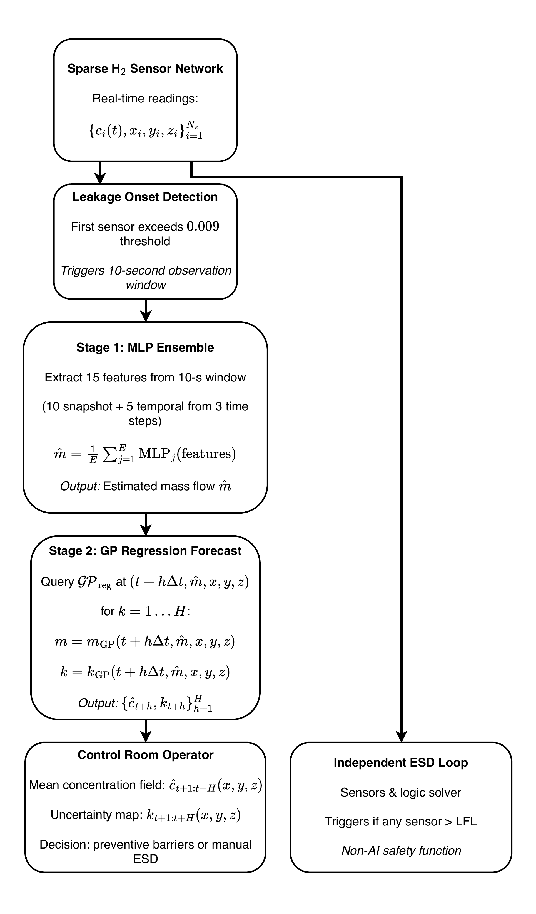
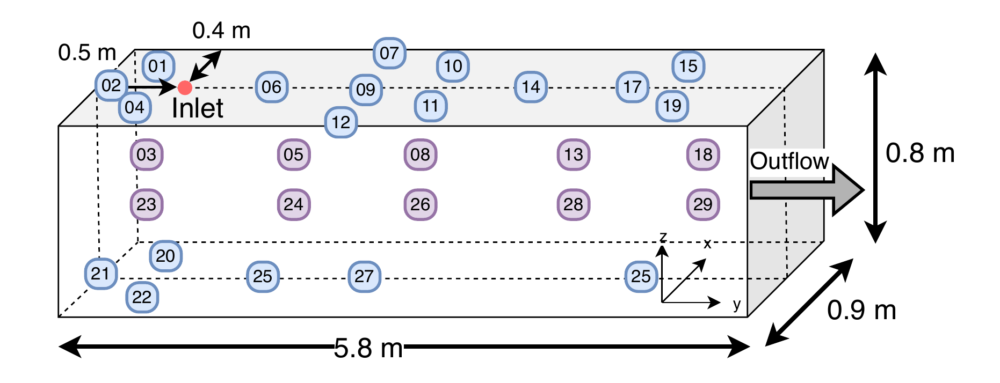

# H2 Dispersion Model

*Additive Gaussian Processes for hydrogen dispersion, powered by an MLP ensemble leakage-rate estimator.*

This repository models the spatiotemporal evolution of released hydrogen by combining CFD simulations and experimental sensor data. It combines leakage-rate estimation via an MLP ensemble and hydrogen dispersion forecasting into a predictive framework.

## Framework Overview

The model pipeline combines an MLP ensemble for leakage-rate estimation with an additive Gaussian Process for spatiotemporal H₂ concentration prediction.



## Experimental Geometry

The CFD and experimental campaigns share the same sensor placement and channel geometry. This is also important to keep in mind for the limitations of this model.



## What it does

- **Predicts** H₂ volume fraction across a 3D sensor field at any time using an **additive Gaussian Process**.
- **Infers** the leakage mass flow rate from sparse early-time observations via an **MLP ensemble**.
- **Fuses** CFD scenarios and experimental campaigns into one unified dataset.
- **Anchors** predictions to a fixed release location and aligns them to the release onset.

## Data

This repository does **not** contain the raw datasets because of their size. The data are split into two sources:

1. **Open experimental dataset** (publicly available)
   - Source: Dataverse.no, DOI `10.23642/USN.26117989`
   - URL: https://dataverse.no/dataset.xhtml?persistentId=doi:10.23642/USN.26117989
   - Download and extract the archives under `data/raw/` so that each experiment has its own folder, e.g. `data/raw/23_FFI_P101_T00003/*.csv`.

2. **CFD simulation data** (not publicly available)
   - The CFD scenarios used in the paper were provided by a colleague and are not hosted online.
   - If you do not have access to this data, set `include_cfd` to `false` in `config.json` and run the pipeline with only the open experimental data.

### Expected directory layout

```
data/
├── raw/
│   ├── 23_FFI_P101_T00003/
│   │   └── ...csv
│   ├── 23_FFI_P101_T00004/
│   │   └── ...csv
│   └── ...
└── CFD/          (only if include_cfd is true)
    ├── A/
    │   └── h2Sensor*/0.1/data.csv
    ├── B/
    └── ...
```

## Configuration

Pipeline behavior is controlled by `config.json` at the repository root.

### Data sources

```json
{
  "data_sources": {
    "include_experiments": true,
    "include_cfd": false
  }
}
```

- `include_experiments`: process the open experimental releases from Dataverse.no.
- `include_cfd`: process the private CFD scenarios. Set this to `true` only if you have the CFD data.

### Dataset mode

```json
{
  "dataset_type": "raw",
  "release_onset": {
    "threshold": 0.009,
    "include_initial": false,
    "include_lag1": true
  }
}
```

- `dataset_type`: `"raw"` or `"preprocessed"`.
  - `"raw"`: minimal processing — just resample CFD, convert experimental units, and combine the enabled sources. No time shifting, no end-of-release cut-offs, no release-onset features.
  - `"preprocessed"`: raw processing plus end-of-release cut-off, per-scenario release onset (`t_release`, `time_since_release`), optional `h2_initial`, and `h2_lag_1`. The original `time` column is replaced by `time_since_release`.
- `release_onset`: controls the onset detection threshold and optional columns in preprocessed mode.

You can also edit the `paths` section if you prefer to keep data outside the repository root.

## Usage

Run the scripts from the repository root. `build_dataset.py` is the single entry point for dataset creation; the mode is selected in `config.json`.

### 1. Build the dataset

```bash
python build_dataset.py
```

This reads the enabled data sources from `config.json` and writes the dataset chosen by `dataset_type`:

- **Raw mode** (`"dataset_type": "raw"`):
  - `data/unified_raw.csv`
  - `data/unified_raw_summary.txt`

- **Preprocessed mode** (`"dataset_type": "preprocessed"`):
  - `data/unified_preprocessed.csv`
  - `data/unified_preprocessed_summary.txt`

The preprocessed dataset contains `time_since_release`, `t_release`, and `h2_lag_1` (included by default; set `release_onset.include_lag1` to `false` to disable). The original `time` column is removed because `time_since_release` becomes the temporal coordinate.

### 2. Train the Stage 1 mass-flow estimator

```bash
python massflow_estimator.py
```

This reads `data/unified_preprocessed.csv` and trains the MLP ensemble used for early-time leakage-rate estimation.

### 3. Train the GP dispersion model

For local development or small-scale experiments, use the example block at the bottom of `h2_dispersion_gp.py`. For longer unattended runs, use:

```bash
bash run_training.sh [optional_experiment_name]
```

Both read `data/unified_preprocessed.csv`, launch the training in the background, log progress to `logs/`, and write a summary to `experiments/`.

## Dependencies

The code is written in Python and relies on the following packages. A full list is provided in `requirements.txt`.

Core numerical / ML stack:
- Python 3.9+
- PyTorch
- GPyTorch
- pandas
- NumPy
- SciPy
- scikit-learn

Visualization and utilities:
- matplotlib
- tqdm
- Jupyter (for the analysis notebooks)

Install them with:

```bash
pip install -r requirements.txt
```

Note: GPyTorch and PyTorch versions should be compatible with your CUDA version if you train on a GPU. The CPU-only versions are sufficient for running the data-preparation scripts.

## Notebooks

The repository includes `data_analysis.ipynb` and `kernel_analysis.ipynb` for exploratory analysis. They currently contain some absolute paths and filename references from the original development machine. If you are using this repository on a different machine, update the paths in the notebooks to match your local setup.

## License

This repository is provided as a complement to the journal publication. Please cite the paper if you use the code or the open dataset in your own work.
